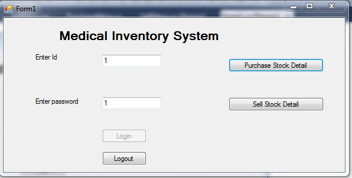
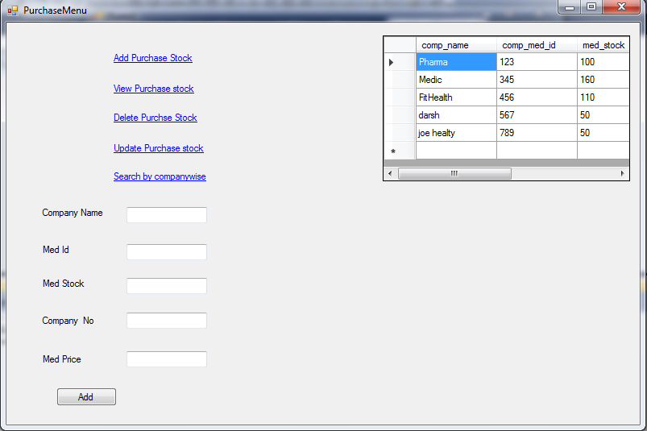
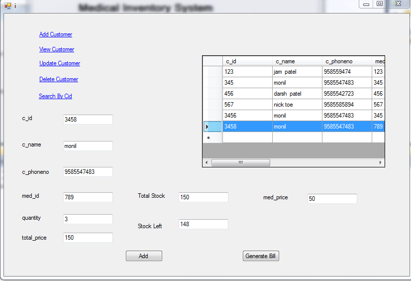
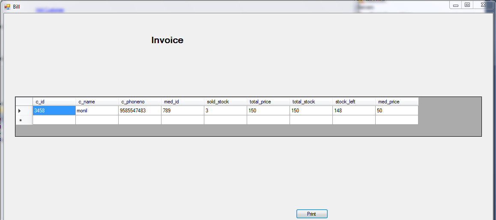

# Medical-Inventory-System
Medical System to maintain Purchase Stock and Sell stock detail for retailer

Purchase Stock Detail include:
1)Add stock
2)View Stock
3)Delete stock
4)Update Stock
5)Search Stock By company Wise

SellStock include:
1)Add customer
2)View Customer
3)Update Customer detail
4)Delete customer Detail
5)Search Customer by c_id

It generate bill for every selling and generate reports for stock, sell, and customer detail

# Screenshot

